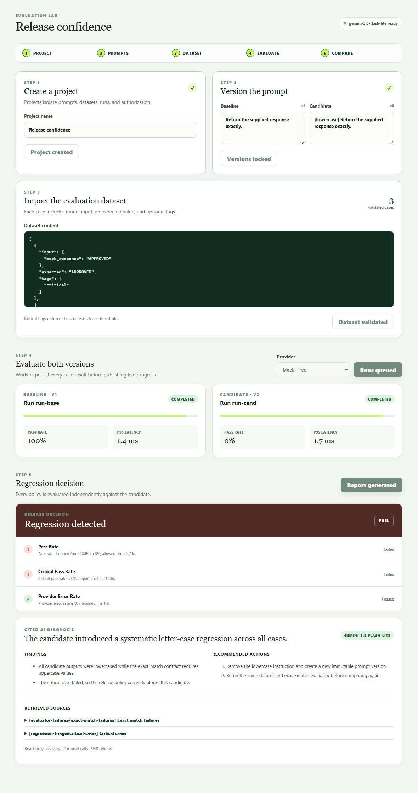
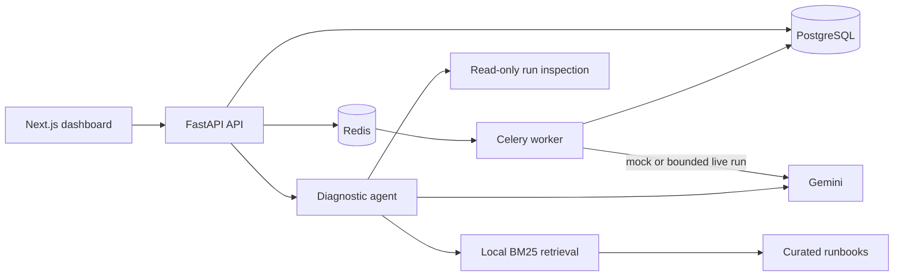

# EvalPulse

**A production-minded platform for evaluating prompts, catching regressions, and diagnosing failures.**

[Live demo](https://evalpulse-web.onrender.com) ·
[Architecture](docs/architecture.md) ·
[AI design](docs/ai-integration.md) ·
[Operations](docs/operations.md)

> The demo runs on Render's free tier and may take a moment to wake up. Sign in with
> `demo@evalpulse.local` / `evalpulse-demo`.



## What it does

EvalPulse gives teams a repeatable workflow for shipping prompt changes with evidence instead of
intuition:

- **Version and evaluate** prompts and datasets with deterministic mocks or bounded Gemini runs.
- **Catch regressions** by comparing candidates with baselines and explicit release policies.
- **Diagnose failures** through a read-only RAG agent that cites curated engineering runbooks.
- **Stay reliable** with idempotent workers, cancellation, live progress, authentication, CSRF
  protection, health checks, and metrics.
- **Control cost and risk** with server-side model allow-listing, token limits, run caps, daily quotas,
  scoped agent tools, and validated citations.

## Architecture



PostgreSQL is authoritative; Redis stores only replaceable queue, cache, cancellation, and progress
state. Each result is persisted before progress is published, making worker retries safe. Diagnostic
tools are bound to the authenticated run, so model-supplied IDs cannot widen access.

## Built with

| Layer | Technology |
| --- | --- |
| Web | Next.js, React, TypeScript |
| API | FastAPI, Pydantic, SQLAlchemy |
| Jobs | Celery, Redis |
| Data | PostgreSQL, Alembic |
| AI | Gemini, local BM25 retrieval, structured tool calling |
| Delivery | Docker Compose, Render, Neon, GitHub Actions |
| Quality | Pytest, Ruff, mypy, Playwright |

## Run locally

Docker Desktop with Compose is the only requirement; Gemini is optional because mock inference is the
default.

```bash
git clone https://github.com/MarvelousJade/evalpulse.git
cd evalpulse
cp .env.example .env # PowerShell: Copy-Item .env.example .env
docker compose up --build
```

Replace `SESSION_SECRET` in `.env` with a random value of at least 32 characters. Then open
<http://localhost:3000>; FastAPI docs are available at <http://localhost:8000/docs>.

To enable bounded live evaluations and cited diagnoses, set `LLM_ENABLED=true` and add a restricted
`GEMINI_API_KEY` to `.env`. See [AI integration](docs/ai-integration.md) for the guardrails and threat
model.

## Verify

```bash
python -m pytest
python -m ruff check python tests scripts
python -m mypy python/evalpulse
npm run typecheck
npm run lint
npm run build --workspace @evalpulse/web
```

The test suite covers evaluation rules, authentication, CSRF, idempotency, regression comparison,
provider normalization, retrieval, agent scoping, citation filtering, and diagnosis caching.
