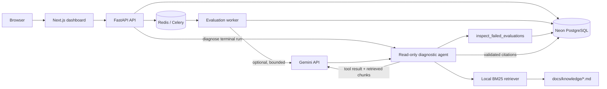
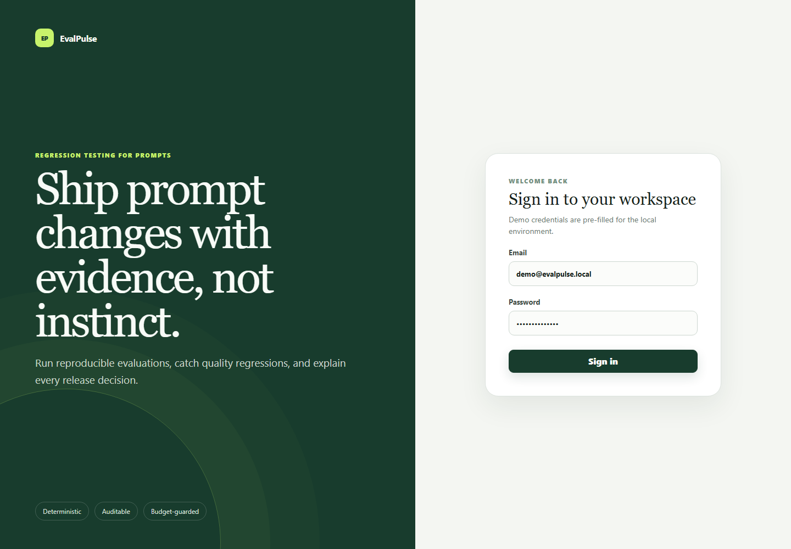

# EvalPulse

EvalPulse is a prompt-evaluation and regression-testing platform built with Next.js, FastAPI,
Celery, PostgreSQL, and Redis. It supports reproducible mock evaluations, budget-guarded live Gemini
runs, regression policies, and a read-only RAG agent that diagnoses failed evaluations with citations.

[Open the live deployment](https://evalpulse-web.onrender.com) ·
[API and agent design](docs/ai-integration.md) ·
[Operations guide](docs/operations.md) ·
[Verification notes](docs/verification.md)

> The deployment uses Render's free compute tier with Neon PostgreSQL and may need a short cold
> start. Demo login: `demo@evalpulse.local` / `evalpulse-demo`.


## What it demonstrates

- Immutable prompt and dataset versions with retry-safe evaluation runs.
- Deterministic mock inference for free, reproducible local development and CI.
- A real, server-side Gemini 3.5 Flash-Lite provider behind strict input, output, case, and daily caps.
- Exact-match, JSON, schema, phrase, regex, required-key, and latency evaluators.
- Baseline-versus-candidate policies with an explanation for every release decision.
- Local BM25-style retrieval over curated Markdown runbooks—no embedding API or vector database.
- A constrained agent tool that inspects failed cases, returns structured recommendations, validates
  source IDs, and persists one diagnosis per run.
- Session authentication, project authorization, CSRF protection, idempotency, cancellation, live
  progress, migrations, metrics, health checks, and deployment manifests.

## Verified outcomes

- Kept worker retries idempotent: executing the same two-case evaluation twice persisted exactly two
  results, not four.
- Detected a deliberately seeded prompt regression through the authenticated import, evaluation,
  aggregation, and baseline-comparison workflow, returning an explicit failed release decision.
- Constrained diagnostic access to the already-authorized run and discarded citation IDs that were
  not present in the retrieved evidence.
- Re-verified 21 automated tests locally on July 29, 2026: 16 Python tests with 80% statement
  coverage across 1,380 statements, plus 5 typed API-client contract tests.

These are repository test outcomes, not production traffic claims. The broader Compose, browser, and
container baseline is recorded in [verification notes](docs/verification.md).

## Architecture



PostgreSQL is authoritative. Redis holds only replaceable queue, cache, cancellation, and live-progress
data. The worker writes each result before publishing progress, so duplicate task delivery is safe.
The diagnostic tool is bound to the already-authorized route run ID; model-supplied identifiers cannot
expand its project scope. See [the detailed architecture](docs/architecture.md).

## Setup

### Docker Compose

Requirements: Docker Desktop with Compose. A Gemini key is optional because the mock provider remains
the default.

```powershell
git clone https://github.com/MarvelousJade/evalpulse.git
cd evalpulse
Copy-Item .env.example .env
```

Set a long random `SESSION_SECRET` in `.env`. To enable live evaluation and diagnosis, also set:

```dotenv
LLM_ENABLED=true
GEMINI_API_KEY=your_restricted_server_side_key
GEMINI_MODEL=gemini-3.5-flash-lite
```

Never commit or paste the key into browser code. `.env` is ignored by Git.

```powershell
docker compose up --build
```

Open <http://localhost:3000> and sign in with `demo@evalpulse.local` / `evalpulse-demo`. FastAPI's
interactive documentation is at <http://localhost:8000/docs>. Compose waits for PostgreSQL, applies
Alembic migrations, starts the API and worker, and then starts the web application.

For process-level development without Compose, use the [operations guide](docs/operations.md).

## RAG and agent demo

Run the included one-case demo after the stack is healthy:

```powershell
python scripts/demo_ai.py http://localhost:8000
```

The demo intentionally gives an arithmetic answer an impossible expected value, guaranteeing a safe
failed evaluation. The workflow is:

1. Gemini produces the evaluated answer through the normal provider interface.
2. The agent must call `inspect_failed_evaluations`; the API executes it read-only for the authorized
   run and ignores any model-proposed run identifier.
3. EvalPulse derives a query from evaluator evidence and retrieves the top local runbook sections.
4. Gemini receives bounded evidence plus retrieved chunks and returns schema-constrained JSON.
5. The API drops unknown citation IDs and persists the diagnosis, sources, evidence, and token usage.

Trimmed output from a live Gemini 3.5 Flash-Lite run:

```json
{
  "pass_rate": 0.0,
  "diagnosis": "The evaluation failed due to an intentional strict exact match mismatch on a demo case.",
  "findings": [
    "The generated answer did not match the intentionally impossible expected value.",
    "There were no provider errors; the run completed successfully with a pass rate of 0 out of 1."
  ],
  "actions": [
    "Keep the strict exact match evaluator as intended and do not weaken it.",
    "Review the demo dataset expectation if this intentional failure is no longer required."
  ],
  "citations": [
    "docs/knowledge/regression-triage.md#triage-order",
    "docs/knowledge/evaluator-failures.md#exact-match-failures"
  ],
  "usage": {
    "calls": 2,
    "input_tokens": 908,
    "output_tokens": 238
  }
}
```

The mock provider still powers the default dashboard workflow, so contributors and CI never need a
paid credential. Current model pricing and the complete abuse-control rationale are documented in
[AI integration](docs/ai-integration.md).

## Screenshots

| Sign in | Regression and cited diagnosis |
| --- | --- |
|  |  |

The screenshots are reproducible UI captures with controlled API fixtures:

```powershell
npm run dev --workspace @evalpulse/web
node scripts/capture_readme_screenshots.mjs
```

## Verification

```powershell
.venv\Scripts\python.exe -m pytest
.venv\Scripts\python.exe -m ruff check python tests scripts
.venv\Scripts\python.exe -m mypy python\evalpulse
npm run typecheck
npm run lint
npm run build --workspace @evalpulse/web
```

The suite covers evaluators, authentication, CSRF, idempotent runs, regression comparison, provider
normalization, model allow-listing, retrieval ranking, tool scoping, citation filtering, and diagnosis
caching. Playwright covers the complete reviewer workflow.

## Repository map

- `apps/web`: Next.js dashboard
- `services/api`: FastAPI process entry point and migrations
- `services/worker`: Celery evaluation worker
- `python/evalpulse`: domain, persistence, providers, RAG, agent, and evaluators
- `docs/knowledge`: curated Markdown knowledge base used by retrieval
- `migrations`: Alembic schema history
- `tests`: Python integration/unit tests and Playwright end-to-end coverage
- `infra/k8s`: Kustomize base and local/production overlays
- `render.yaml`: hosted Render Blueprint with external Neon PostgreSQL

## Security and cost boundaries

- The Gemini key stays in server environment variables and is sent in a header, never a URL,
  browser bundle, prompt, response, run configuration, or application log.
- The Gemini origin, stable model, generation settings, and token caps are server-controlled.
- Live runs have per-run case caps and a database-derived daily request allowance.
- Diagnosis is authenticated, CSRF-protected, read-only, daily-limited, and cached once per run.
- Retrieved text and evaluation evidence are treated as untrusted data; generated citations are
  allow-listed against the retrieval result.

These application controls are defense in depth. Restrict the key to the Gemini API and deployment
egress IP, and configure provider-side prepaid credit, quotas, budgets, and alerts.
