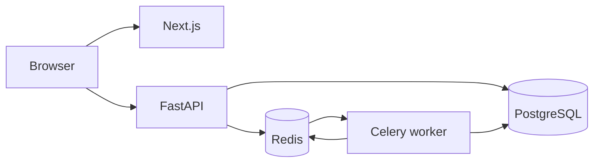

# Architecture

EvalPulse separates browser delivery, HTTP orchestration, and evaluation work into independently deployable processes.

PostgreSQL stores all identity, version, run, result, comparison, and durable event records. Redis provides the Celery broker, ephemeral cancellation flags, cache entries, and live progress fan-out. Loss of Redis can delay active work but cannot remove a completed result.

The API commits a queued run and dispatch record before attempting queue delivery. Workers atomically claim queued runs, upsert case results by `(run_id, test_case_id)`, and treat duplicate deliveries as no-ops. Server-Sent Events combine durable event replay with best-effort live progress.

The default provider is deterministic: its output is derived only from immutable prompt text, case input, and provider configuration. This keeps development, CI, and portfolio demonstrations reproducible and free.

