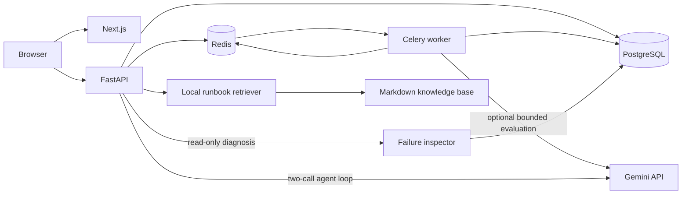

# Architecture

EvalPulse separates browser delivery, HTTP orchestration, and evaluation work into independently deployable processes.

PostgreSQL stores all identity, version, run, result, comparison, and durable event records. Redis provides the Celery broker, ephemeral cancellation flags, cache entries, and live progress fan-out. Loss of Redis can delay active work but cannot remove a completed result.

The API commits a queued run and dispatch record before attempting queue delivery. Workers atomically claim queued runs, upsert case results by `(run_id, test_case_id)`, and treat duplicate deliveries as no-ops. Server-Sent Events combine durable event replay with best-effort live progress.

The default provider is deterministic: its output is derived only from immutable prompt text, case input, and provider configuration. This keeps development and CI reproducible and free. A live `gemini` provider uses the same normalized provider interface, while its model, endpoint, timeout, input size, output tokens, per-run cases, and daily allowance are controlled only by server settings.

AI diagnosis is a bounded agent loop. The first model call is forced to select the single
`inspect_failed_evaluations` tool. The API ignores the model's run identifier and executes the tool
against the already-authorized route parameter. A small BM25-style retriever selects relevant chunks
from `docs/knowledge`; the second call receives the bounded evidence and retrieved chunks and returns
structured advice. Citation IDs are allow-listed against retrieved chunks before a diagnosis is
persisted. The tool cannot mutate prompts, datasets, policies, credentials, runs, or deployments.
